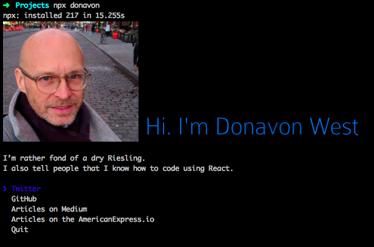

# donavon
[](https://travis-ci.org/donavon/donavon)

> The [Donavon West](http://donavon.com) CLI



## Usage

Install Node.js, then:

```
$ npx donavon
```


## Origin

This was forked from the fantastic work done by [Sindre Sorhus](https://github.com/sindresorhus/sindresorhus).

## License

MIT © [Donavon West](http://donavon.com)
